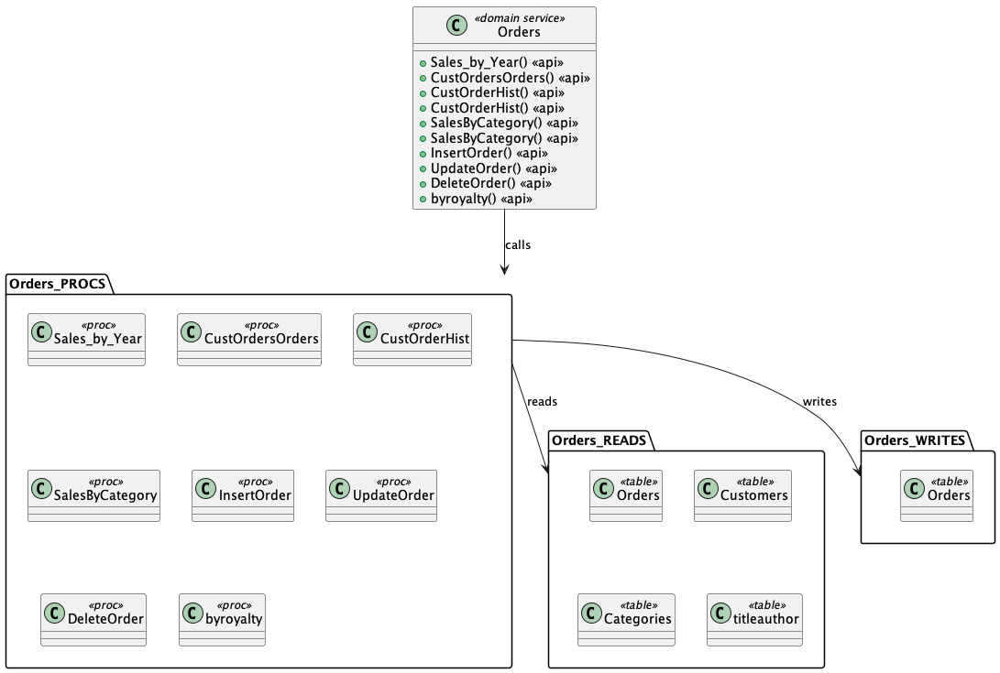
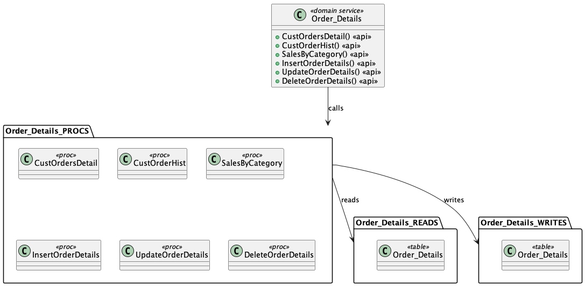

# Source Insights Demo App

# Intro

This project uses [langchain](https://python.langchain.com/) on Open AI's GPT models to parse SQL code and create diagrams of candidate service definitions that
could be written to sit over the top of the database layer.  The idea is to facilitate the use of the [strangler pattern](https://martinfowler.com/bliki/StranglerFigApplication.html) to write
a layer of services over the database procedures, then to start extracting the procedure logic into the service layer.

The program achieves this by:

1. Parsing the sql code into a pandas dataframe containing all the DDL definitions.
2. Iterating over all the stored procedure code and creating a map of tables that are called by each stored procedure.  The map indicates which tables are queried or updated.
3. Clustering stored procedures together based on their name, the names of the underlying tables and the types of operations performed (READ or WRITE).
4. Creating service definitions from the clustered procedure map.
5. Generating diagrams of the services.

Here's an example of the output:



And another one:



# Findings

The project can successfully find all the stored procedures and the tables that are queried using a GPT-3.5-tubo model.

It uses [scikit-learn](https://scikit-learn.org/stable/) to clusters the procs into sensible groups using KMeans squared clustering, 
based on the names of the procs, tables and the operations performed.  The clustering works pretty well and could be easily tuned 
to desired output.  The interim results are cached in a file called `results/service_candidates_cache.csv` which can be manually 
tweaked after initial clustering to get the desired final output.

[PlantUml](https://plantuml.com/) is used to generate the diagrams.

Lessons learned:

1. GPT models have a [token limit](https://help.openai.com/en/articles/4936856-what-are-tokens-and-how-to-count-them), so you need a way to feed information into the model that suits your use case. e.g. summarisation versus search etc.
2. For this use case a the GPT model was used to parse all the code and identify all the DML statements within it.  The results were stored in a pandas dataframe so that the information could be retrieved easily.  It then became very easy to find every CREATE PROCEDURE statement, for example.
3. Once all the code was classified into DML statements, the stored procedures were extracted and the GPT model was used again to extract the tables that are queried by each procedure.
4. The GPT model wasn't very good at identifying which tables fell within a procedure, so a regex was used to ensure that the code fed into the model only included code for a particular procedure.
5. Results were good with a GPT-3.5-turbo model and temperature of 0.
6. [Few shot prompting](https://www.promptingguide.ai/techniques/fewshot) was used to ensure that the LLM had examples of what was expected.
    Here's an example

    ```text
    Example:
    CREATE TABLE "Products"
    Expected output:
    { "db_object_name": "Products", "sql_operation": "CREATE TABLE"}

    Example:
    create procedure "Sales by Year"
    Expected output:
    { "db_object_name": "Sales by Year", "sql_operation": "CREATE PROCEDURE"}
    ```

7. By specifying the output as a JSON array it was easy to consume the results in python.
    
    Here's the prompt:

    ```text
    ## OUTPUT FORMAT ##
    json object array, containing the name of the database object and the DDL statement type in UPPERCASE text.
    Example:
    [{ "db_object_name": "EmployeeID", "sql_operation": "CREATE INDEX"}]
    ```

    And the python code:

    ```python
    import json

    ...

    result = json.loads(llm_response.content)
    ```

8. The cost to run the code repeatedly during development was typically a few cents per day.
9. [LLM development tools such as LangSmith](https://docs.smith.langchain.com/) are emerging too.

# Next steps

To create a production ready solution, the following steps are needed:

* Test with [Azure Open AI](https://learn.microsoft.com/en-us/azure/ai-services/openai/quickstart?tabs=command-line&pivots=programming-language-python).
* Test with limited Informix code example.
* Create a short design document outining the solution in Azure.
* Perform security threat modelling to gain security accreditation.
* Test and fine tune the solution with production Informix code.

# Running the code

Steps to get started:

1. Clone the repo
2. Open a terminal in the source directory
3. Call `pipenv install` from the terminal
4. [Install PlantUML dependencies manually](https://plantuml.com/starting) - graphviz, Java and PlantUML
5. Create a .env file and store your OPENAI_API_KEY in it
6. Call `pipenv run python main.py`
    * Specify `--debug true` to parse a subset of the SQL code.
    * Specify `--no-cache true` to bypass caching behavior and regenerate everything from scratch.
7. The solution caches data from the following intermediate steps:
    * DML statements
    * Stored proc to table mapping
    * Service candidates
8. With caching on you can manually tweak `service_candidates_cache.csv` to re-group the services how you like.

# Testing

This project uses [pytest](https://docs.pytest.org/), run `pipenv run pytest` at the project root to test.  It will pick up test files named `test_*.py` or `*_test.py` in sub-directories.

# Setting up in Azure

* [Check for service availability in your region](https://learn.microsoft.com/en-us/azure/ai-services/openai/concepts/models#gpt-35-models).  You can also [check the what's new page](https://learn.microsoft.com/en-us/azure/ai-services/openai/whats-new) page.
* Send a request form to Microsoft, who are [limiting access to approved enterprise customers](https://learn.microsoft.com/en-us/legal/cognitive-services/openai/limited-access?context=%2Fazure%2Fcognitive-services%2Fopenai%2Fcontext%2Fcontext) due to high demand.
* [Creating a resource](https://learn.microsoft.com/en-us/azure/ai-services/openai/how-to/create-resource?pivots=web-portal) only requires a few details, such as subscription, resource group, region and name.
* Azure Open AI is essentially a black box SaaS service provided within the customer's tenancy and region.  [Microsoft's security documentation](https://learn.microsoft.com/en-us/legal/cognitive-services/openai/data-privacy?context=%2Fazure%2Fai-services%2Fopenai%2Fcontext%2Fcontext) states that customer data isn't shared with other customers, 3rd parties or used to train the models, unless a customer opts to do so.  The customer is referred to [Microsoft's Products and Services Data Protection Adendum](https://learn.microsoft.com/en-us/legal/cognitive-services/openai/data-privacy?context=%2Fazure%2Fai-services%2Fopenai%2Fcontext%2Fcontext) for details.
* [Azure OpenAI](https://learn.microsoft.com/en-us/azure/ai-services/openai/chatgpt-quickstart?tabs=command-line&pivots=programming-language-python) uses the same `openai` pip package as Open AI's serivce.  Calling the library using the `openai` simply requires that you configure the endpoint URL and API key:

    ```python
    #Note: The openai-python library support for Azure OpenAI is in preview.
    import os
    import openai
    openai.api_type = "azure"
    openai.api_base = os.getenv("AZURE_OPENAI_ENDPOINT") 
    openai.api_version = "2023-05-15"
    openai.api_key = os.getenv("AZURE_OPENAI_KEY")

    response = openai.ChatCompletion.create(
        engine="gpt-35-turbo", # engine = "deployment_name".
        messages=[
            {"role": "system", "content": "You are a helpful assistant."},
            {"role": "user", "content": "Does Azure OpenAI support customer managed keys?"},
            {"role": "assistant", "content": "Yes, customer managed keys are supported by Azure OpenAI."},
            {"role": "user", "content": "Do other Azure AI services support this too?"}
        ]
    )

    print(response)
    print(response['choices'][0]['message']['content'])
    ```

* Azure Open AI [is also supported by langchain](https://python.langchain.com/docs/integrations/llms/azure_openai_example), it has a depdency on the same `opeanai` pip library and you need to configure and instantiate langchain in a similar way to above:

    Setup environment variables:

    ```python
    import os

    os.environ["OPENAI_API_TYPE"] = "azure"
    os.environ["OPENAI_API_BASE"] = "https://<your-endpoint.openai.azure.com/"
    os.environ["OPENAI_API_KEY"] = "your AzureOpenAI key"
    os.environ["OPENAI_API_VERSION"] = "2023-05-15"
    ```

    Instantiate the right LLM model:

    ```python
    from langchain.llms import AzureOpenAI

    llm = AzureOpenAI(
        deployment_name="td2",
        model_name="text-davinci-002",
    )

    response = llm("Tell me a joke")
    print(response)
    ```

* [Azure AD authentication](https://learn.microsoft.com/en-us/azure/ai-services/openai/how-to/switching-endpoints) is supported.

* The [FAQ](https://learn.microsoft.com/en-us/azure/ai-services/openai/faq#how-do-the-capabilities-of-azure-openai-compare-to-openai-) provides more information about data privacy and compatibility with Open AI's services.

# Change History

* 0.0.2 - can read pubs db and extract proc names, but doesn't extract associated tables correctly.  Seems to never finish with nwnd database; haven't investigated the cause yet.
* 1.0.0 - first fully working version; works with Open AI, not Azure yet.

# Useful resources

* [Free Tutorial Series by Samuel Chan](https://www.youtube.com/playlist?list=PLXsFtK46HZxUQERRbOmuGoqbMD-KWLkOS)
* [Neural Network Overview](https://www.youtube.com/watch?v=aIZtJqtzdQs&list=PLMrJAkhIeNNQV7wi9r7Kut8liLFMWQOXn&index=12) - fantastic entry level information about AI and neural networks by Steve Brunton.
* [MS Build - State of GPT](https://www.youtube.com/watch?v=bZQun8Y4L2A) - latest techniques for getting the most out of LLMs.
* [Prompt Engineering Guide](https://www.promptingguide.ai/)
* [Microsoft Open Source Guidance Framework](https://github.com/microsoft/guidance) - template based prompt engineering framework.
* [Llama-Index Index Types](https://gpt-index.readthedocs.io/en/latest/guides/primer/index_guide.html)
* [Next generation AI for developers with the Microsoft Cloud](https://www.youtube.com/watch?v=KMOV1Zy8YeM&list=PLlrxD0HtieHjolPmqWVyk446uLMPWo4oP&index=4&t=2210s) - overview of Azure Open AI
* [Getting started with generative AI using Azure OpenAI Service](https://www.youtube.com/watch?v=o5uhn4GSpQU&list=PLlrxD0HtieHjolPmqWVyk446uLMPWo4oP&index=123) - more detail on Azure Open AI
* [The era of the AI Copilot](https://www.youtube.com/watch?v=FyY0fEO5jVY&list=PLlrxD0HtieHjolPmqWVyk446uLMPWo4oP&index=146) - about Microsoft copilots.
* [Chat with OpenAI CEO and and Co-founder Sam Altman, and Chief Scientist Ilya Sutskever](https://www.youtube.com/watch?v=mC-0XqTAeMQ&t=1s)

### Key recommendations from Open AI about how to get the most out of GPT


Credit: [Microsoft Build Presentation by Andrej Karpathy](https://www.youtube.com/watch?v=bZQun8Y4L2A)
