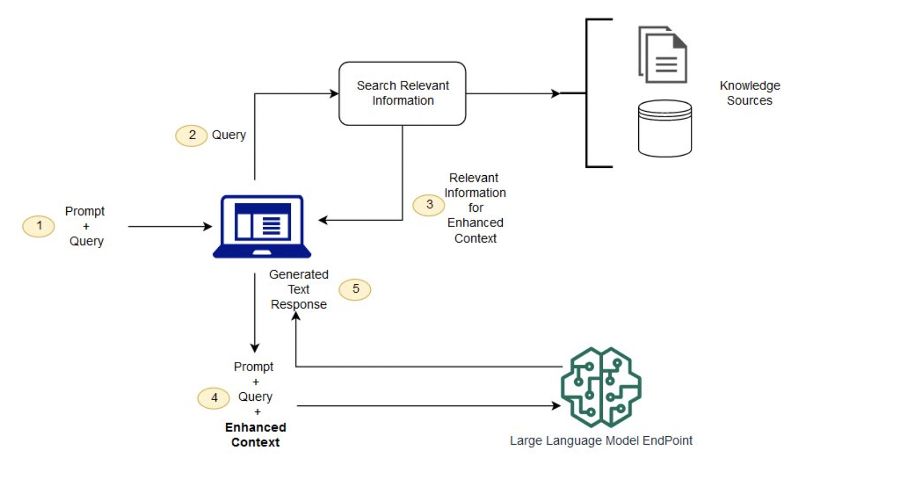

# Source Insights Demo App

# Intro

The repo contains a bunch of generative AI demos; inspired by various tutorials found online.

One of the main focus areas was to find out whether a GPT model could be used to read complex SQL code and
create useful information about the code artefacts (procs, tables, fk relationships) and the dependencies 
between them.  The intention was to see if AI can provide a simpler approach to more traditional methods 
such as using SQL language parsers.

Note that GPT stands for Generative Pre-trained Transformer, that is a type of language model that uses a transformer architecture to generate coherent and contextually relevant text. It is a deep learning model that has been pre-trained on a vast amount of text data and can be fine-tuned for specific downstream natural language processing (NLP) tasks.

The demos make use of a few different API's and frameworks:

1. [Open AI SDK](https://platform.openai.com/docs/libraries) - simple SDK, easy to learn
2. [langchain](https://python.langchain.com/) - Popular framework that provides abstractions over the top of a broad range of AI technologies.  Still not to hard to learn, good documentation.
3. [llama-index](https://gpt-index.readthedocs.io/en/latest/guides/primer/usage_pattern.html) - Another popular framework that really shines when implementing Retrieval Augmented Generation (RAG) style programs.  Supports a range of different content search indices to fit different analysis use cases, such a content summarisation, answering specific questions etc.

# Findings

Key findings so far:

1. You can successfully extract information about key source code elements with quite simple python programs and some well crafted prompts.  Significantly less complexity than language parsing.
2. The time taken to build this was a few hours; most of the time was spent learning about AI ;-)
3. Not getting ALL the artefacts and sometimes see differences in what is returned from one run to the next, even when "temperature" is set to zero.
4. Sometimes the results aren't formatted correctly either; although these issues could be easily fixed with standard coding techniques, or a second pass through with LLM.
5. The area that was least successful was in extracting all the tables and when trying to find relationships between them by searching for foreign key relationships.
6. There are a handful of "levers" that you need to tune to get the best results:
    * LLM Model and associated token limit - e.g. GPT3 vs 3.5 or 4.  Wasn't able to try GPT-4 yet.
    * GPT Model "temperature" - set to 0 for less randomness in the response.
    * Different styles of prompts sent to the LLM.
        * Few shot prompting
        * Letting the LLM know "where" in vector space to look e.g. "As a SQL programmer..."
    * Look into retrieval augmented generation (RAG) for better summarisation across the code base.

What is Retrieval Augmented Generation (RAG):

Credit: [AWS Sagemaker documentation](https://docs.aws.amazon.com/sagemaker/latest/dg/jumpstart-foundation-models-customize-rag.html)

Key recommendations from Open AI about how to get the most out of GPT:

Credit: [Microsoft Build Presentation by Andrej Karpathy](https://www.youtube.com/watch?v=bZQun8Y4L2A)

# Next steps

* Will keep playing with this, for fun! (i.e. not work!)
* The business value and cost to implement isn't clear enough yet to recommend a project.
* There are other relatively low cost alternatives for SQL code analysis that should also be considered alongside AI, such as [Informix SQL Parser](https://www.sqlparser.com/informix-sql-parser.php), as well as commercial database design and data governance tools.

# Useful references

* [Free Tutorial Series by Samuel Chan](https://www.youtube.com/playlist?list=PLXsFtK46HZxUQERRbOmuGoqbMD-KWLkOS)
* [Neural Network Overview](https://www.youtube.com/watch?v=aIZtJqtzdQs&list=PLMrJAkhIeNNQV7wi9r7Kut8liLFMWQOXn&index=12) - fantastic entry level information about AI and neural networks by Steve Brunton.
* [MS Build - State of GPT](https://www.youtube.com/watch?v=bZQun8Y4L2A) - latest techniques for getting the most out of LLMs.
* [Prompt Engineering Guide](https://www.promptingguide.ai/)
* [Microsoft Open Source Guidance Framework](https://github.com/microsoft/guidance) - template based prompt engineering framework.
* [Llama-Index Index Types](https://gpt-index.readthedocs.io/en/latest/guides/primer/index_guide.html)
* [Next generation AI for developers with the Microsoft Cloud](https://www.youtube.com/watch?v=KMOV1Zy8YeM&list=PLlrxD0HtieHjolPmqWVyk446uLMPWo4oP&index=4&t=2210s) - overview of Azure Open AI
* [Getting started with generative AI using Azure OpenAI Service](https://www.youtube.com/watch?v=o5uhn4GSpQU&list=PLlrxD0HtieHjolPmqWVyk446uLMPWo4oP&index=123) - more detail on Azure Open AI
* [The era of the AI Copilot](https://www.youtube.com/watch?v=FyY0fEO5jVY&list=PLlrxD0HtieHjolPmqWVyk446uLMPWo4oP&index=146) - about Microsoft copilots.
* [Chat with OpenAI CEO and and Co-founder Sam Altman, and Chief Scientist Ilya Sutskever](https://www.youtube.com/watch?v=mC-0XqTAeMQ&t=1s)

# Running the code

For `main.py`, which is based on langchain:

1. Clone the repo
2. Open a terminal in the source directory
3. Call `pipenv install` from the terminal
3. Create a .env file and store your OPENAI_API_KEY in it
4. Call `pipenv run python main.py`

For `llama_demo.py` you can run it with `--create-index` command line switch to build a local vector store index from the content, then you can run is without this switch in subsequent runs to reduce time and cost.  You can also switch between northwind and pubs db code using the `--db <name>` switch.  The index is created locally in JSON format under the ./index directory.

# Change History

* 0.0.2 - can read pubs db and extract proc names, but doesn't extract associated tables correctly.  Seems to never finish with nwnd database; haven't investigated the cause yet.
